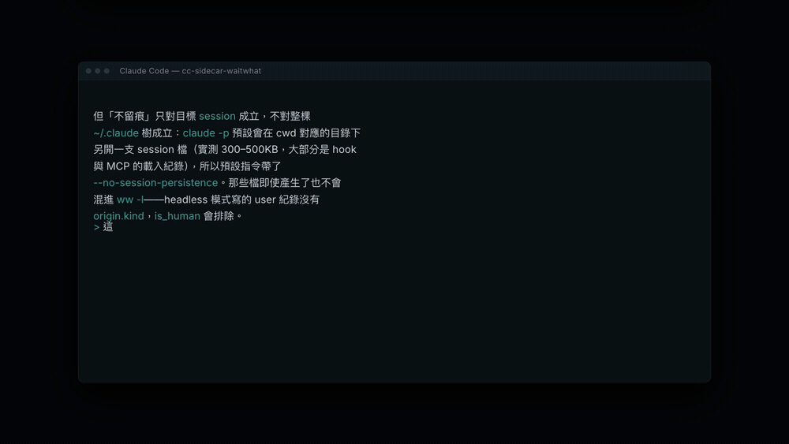

# cc-sidecar-waitwhat

Replay what Claude Code just said, from outside the session. CC never finds out you did.

*[中文版](README.md)*



| Command | What it does | What it sends | Measured |
|---|---|---|---|
| `ww` | You lost the thread — replay the whole session | Every turn plus the tool calls | 68,171 chars → 864 tokens, 19.6s |
| `ww 1` | You didn't follow this one — replay it plainly | Your question plus that turn's full reply | 2,315 chars → 184 tokens, 10.9s |
| `ww 3` | Go back three turns | The last three turns | 7,290 chars → 301 tokens, 11.0s |

The number counts turns backwards. It does not pick a session — that's `-s`. A turn is one message from you plus every reply before your next one, tool calls included.

## Why not just ask CC to explain again

Asking in the session costs you four things. This tool removes two of them:

| Cost | Default path (`claude -p`) | Different vendor |
|---|---|---|
| 1. The retelling stays in context, carried every turn after | Gone | Gone |
| 2. The one explaining is CC, wearing the same blind spot | Half gone. Separate process, clean conversation, but the same model family and the same CLAUDE.md | Gone |
| 3. Asking is itself a signal that bends what comes after | Gone | Gone |
| 4. Tokens | Not gone. Moved to another call, plus a whole harness of system context | Gone (you pay elsewhere) |

Cost 3 is the one people miss. Ask a model to re-explain a passage and you've told it that passage matters; the next several turns lean toward it. That's not about explaining well or badly — observing changed the thing observed.

If you only need the model kept in the dark, and don't mind CC's own UI knowing you pressed a button, [cc-mod-waitwhat](https://github.com/GGGODLIN/cc-mod-waitwhat) is the Claude Mods version that runs inside CC: buttons above the prompt, no second terminal, no session picking, same environment variables and prompt overrides.

One guarantee holds: **nothing about the replay reaches the target session's JSONL**. That file is written one way, and reading it from outside leaves no trace. Which also means anything typed inside CC fails the bar, including `!` shell escapes.

The guarantee covers the target session, not all of `~/.claude`. `claude -p` opens its own session file under the cwd it ran in — 300–500KB, mostly hook and MCP loading records — so the default command passes `--no-session-persistence`. Those files never reach `ww -l` anyway: headless mode writes user records without `origin.kind`, and `is_human` drops them.

## Picking the session

Three routes, tried in order. When the first one hits, it leads the list and the rest are still listed below it.

### First: the neighbour in the same tab

Orca and herdr both put a tab id into every pane's environment, and the CC process inherits it:

```
ORCA_TAB_ID     → Orca
HERDR_TAB_ID    → herdr
```

ww reads its own pane's value and scans CC processes' environments with `ps -E`; a matching value means the same tab. So split a pane next to CC, run ww there, and it knows which session you mean without asking anyone what is focused.

From the pid, the session id follows from two rules:

1. a uuid on the command line wins (`claude --resume <id>` / `--session-id <id>`)
2. otherwise match the process start time against the first record in each session file, and accept it only if exactly one lands within 5 seconds

Not unique means no guess — skip it. A CC that just opened has no session file at all, so it is skipped too: nothing said, nothing to re-explain.

This route calls neither the orca nor the herdr CLI; it only reads environment variables. A different multiplexer is one more row in that table, and with none of them the route switches itself off and the next one runs.

### Second: `herdr agent list`

If you run [herdr](https://github.com/herdrdev/herdr), it answers directly:

```
agent_session.value      → session id, maps to ~/.claude/projects/**/<id>.jsonl
focused                  → the pane you're looking at
agent_status             → idle means it's your turn, working means it's still going
terminal_title_stripped  → a name a human can read
```

No argument takes the focused one. `-l` lists, `-s 3` picks the third.

When the first route hits, herdr only fills in the rest of the list; `focused` yields to it, because "the pane in front of you" beats "the pane focused somewhere on this machine".

### Third: scan the files

Without herdr this is your main path, not a fallback: scan `~/.claude/projects/`, sort each session by its last human-typed message, title rows with **what CC said last** — not what you said, since you answer "a" and "ok" too often to tell conversations apart — read cwd from the record rather than reversing the directory slug (that slug replaces both `/` and `.` with `-`, so it can't be reversed), then use `ps` and `lsof` to drop sessions with no live claude process.

You lose three things: no `focused`, no idle/working status, and a lag when you switch sessions, since the new one has no human message yet. The first route wins back the `focused` one.

Don't sort by mtime. Background agents write constantly, so the session you're reading is the stalest one — the ordering comes out backwards.

## Install

```bash
ln -sf "$PWD/bin/ww" ~/.local/bin/ww
```

You need Python and one LLM. No Python packages are required; `rich` makes the output much better if you have it.

### Where to read the output

The only hard requirement: that shell must not be the one running CC.

| Terminal | How |
|---|---|
| Ghostty | Quick terminal, config below |
| iTerm2 | Preferences → Profiles → Keys → set a Hotkey Window |
| tmux | `bind-key w split-window -h 'ww 1; read'`, or keep a pane open |
| kitty | `map cmd+shift+w launch --type=os-window ww 1` |
| Anything | Open a second window and switch to it |

Ghostty (`~/.config/ghostty/config`):

```
keybind = global:cmd+shift+w=toggle_quick_terminal
quick-terminal-position = top
quick-terminal-screen = macos-menu-bar
```

`global:` needs accessibility permission on macOS (System Settings → Privacy & Security → Accessibility). Without it the binding only fires while Ghostty has focus.

If you use herdr, don't open a pane through it to display this — that moves herdr's `focused` to the new pane and the session signal dies.

## Which LLM

Anything that takes text and returns text. `auto` tries `cmd` first, then `http`:

| Source | What it is | Measured |
|---|---|---|
| `cmd` | A shell command: prompt on stdin, answer on stdout | 34.2s (`claude -p --model sonnet`) |
| `http` | Any endpoint speaking OpenAI's `/v1/chat/completions` | 8.8s (local proxy → Gemini Flash) |

With `SIDECAR_CMD` unset and `claude` on PATH, it runs `claude -p --no-session-persistence`. Everyone using this tool has that binary by definition, so a fresh clone works with nothing configured. It's also the slow option — three to four times the HTTP route, mostly CLI startup.

```bash
SIDECAR_CMD='claude -p --model haiku'
SIDECAR_CMD='ollama run llama3'
SIDECAR_CMD='llm -m gpt-4o'
SIDECAR_CMD='my-own-wrapper'          # anything reading stdin and printing stdout
```

Arguments are split with shell word rules (`shlex`) but never run through a shell, so pipes and redirects don't work.

```
── 白話：View A  (de0e89f8, 3,083 chars → cmd:my-own-wrapper)
── 14.9s  source cmd:my-own-wrapper
── 11.4s  source http:gemini-3.8-flash-high  ← fell back: SIDECAR_CMD unset, no claude on PATH
```

Name a single source and it's strict: `--source cmd` exits 1 rather than quietly using another.

### Environment

```bash
SIDECAR_SOURCE=cmd           # default source (auto / cmd / http)
SIDECAR_CMD='...'            # what cmd runs
SIDECAR_PROXY=http://...     # http endpoint
SIDECAR_MODEL=...            # http model
SIDECAR_API_KEY=...          # optional; without it no Authorization header is sent
```

## Replacing the prompts

The two shipped prompts are a starting point. Replay quality is almost entirely the prompt, and "clear" means something different to each person, so this expects you to change them.

Drop files into `~/.config/cc-sidecar-waitwhat/` (`SIDECAR_PROMPT_DIR` moves it):

```
~/.config/cc-sidecar-waitwhat/wait-what.md    ← for ww
~/.config/cc-sidecar-waitwhat/plain.md        ← for ww N
```

They override independently, and an empty file falls back rather than sending an empty prompt.

Neither default pins an output language. They ask for "the same language as the source", so an English session gets English back.

If `~/.claude/glossary.md` exists it's appended as your personal vocabulary — but only when the passage being replayed is longer than the glossary. A short turn under a long glossary leaves the model reading mostly vocabulary. That happened once: 2,050 of 2,722 characters were glossary, and the reply came back saying the content to explain was missing.

## Terminal output

Models answer in markdown, which prints as literal `**`, backticks and fences.

If [rich](https://github.com/Textualize/rich) is installed it renders — real tables, correct CJK width, background-shaded code. `soft_wrap=True` is not optional: without it rich rewraps on whitespace and splits runs of CJK at arbitrary points, turning `2*3*4` into two lines.

Without rich a fifty-line fallback handles bold, inline code, fences, bullets and quotes. It does not lay out tables.

Styling turns itself off when stdout isn't a terminal, so `ww 1 > out.md` gives you clean markdown. `--raw` and `NO_COLOR=1` also disable it.

## Cache

`~/.cache/cc-sidecar-waitwhat.json`, overridable with `SIDECAR_CACHE`. Keys are SHA-256 over the mode plus normalized user/assistant text, excluding the entry point, model source and each tool's payload wrapper. Terminal `ww` and the in-CC buttons therefore hit each other's entries: whichever one answers first supplies the cached answer. Old keys are not migrated, so the first replay of an old conversation after upgrading still calls the model once.

Repeating a command measured 12.09s → 0.877s.

Hit rate is lower than that suggests. One more message in the session changes the payload and the lookup misses — deliberately, since a stale replay is worse than paying again. Real hits come from looking at a finished turn twice.

```bash
ww --cache-stats
ww 1 --no-cache
```

Past 200 entries the oldest go. A corrupt file reads as empty rather than raising.

## Known limits

- **Replays introduce errors.** One test turned a `poll_interval` of 2.0 seconds into 0.2 — both numbers appeared in the transcript and the model took the wrong one. Use a replay to get oriented, not as a source of fact.
- **It tracks CC's session schema** (2.1.270 here). An upgrade could move `origin.kind` or `isSidechain`. The failure mode is no output rather than a quiet wrong answer.
- **Replaying a running agent gives you half a turn.** `-l` shows the status, and `ww` warns before sending.
- `ps` and `lsof` filter closed sessions. Missing them isn't fatal — the step is skipped and closed conversations stay in the list.

Developed on Python 3.14, standard library only. The oldest API used is `subprocess.run(capture_output=...)` (3.7), but nothing between 3.7 and 3.13 has been tested.

## Tests

```bash
python3 -m unittest discover -s tests
```

84 of them, covering parsing, session lookup, same-tab neighbour matching, prompt overrides, cache, terminal rendering and source routing. Two skip without rich. The `cmd` path is tested with `cat`, `head` and `false` standing in for an LLM; `from_files` and `from_pane` run against fixture JSONL plus a fake process list, so none of them needs a real model, herdr, or a live Orca. The herdr and Orca paths depend on external state and have no automated test — split a pane next to CC, run `ww -l`, and check that the first row is the session you are looking at.

## License

MIT
